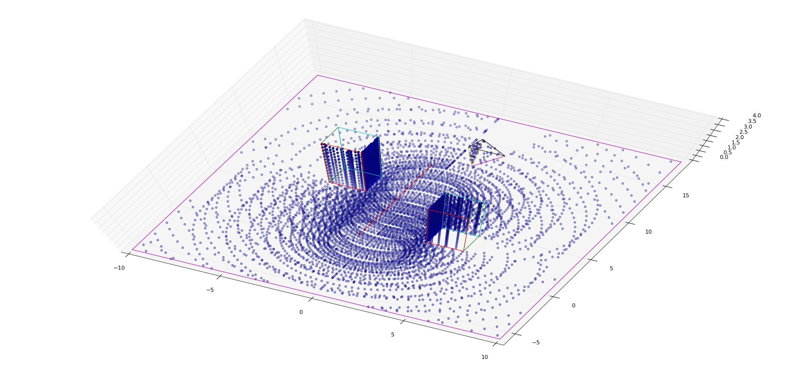

# LiDARSimulation

## Description
LiDARSimulation is a simulator of a LiDAR (Light Detection and Ranging) sensor for a static environment. The environment (vehicle path, sensor configuration, and stuctures/occlusions) are defined in a configuration file (examples in Config folder).

The output of the program for the Config/SimConfigComplex.json configuration file is shown in the 3D figure below. The vehicle path is shown with a red line in the middle of the environment, with the vehicle moving from south-west to north-east. The environment contains three structures: a box shape in the south-eastern part of the scene, a box shape in the north-western part of the scene, and a pyramid in the north-eastern part of the scene. 

The LiDAR sensor detects points on the ground, as well as the visible sides of the three structures. For example, the eastern side of the south-eastern box is not detected by the sensor due to line-of-sight occlusion. Similarly, the northern and western sides of the north-western box are not detected. The pyramid left side facing the vehicle path also gets more LiDAR hits than the right side; the north side of the pyramid is not detected due to line-of-sight occlusions. All these three structures have "shadows" on the ground due to line-of-sight occlucions.

## Build/Run Instructions
The codebase has an external dependency to https://github.com/nlohmann/json and boost, although the boost code is commented out for now. The visualizer is implemented in python (tested with python 2.7). To build the project:
1. Clone, build and install JSON package from https://github.com/nlohmann/json
2. If JSON package is installed in a local folder and not the system folders, update g++ command in build.sh to include the headers folder (with -I flag) and the library folders (with -L/l flags)
3. Run `build.sh` to build the codebase (CMake build system coming soon)
4. Run `./main.exe Config/SimConfigComplex.json` to execute the program. This will generate an output.json file
5. Run `python plot.py Config/SimConfigComplex.json output.json` to visualize the output 

## ToDo List
1. CMake build system
2. Update code to use smart pointers
3. Improve scalability
   * Be selective of which polygons are considered for intersection in each scan
   * Multi-thread Beam.scan calls
4. Create real-time visualizer